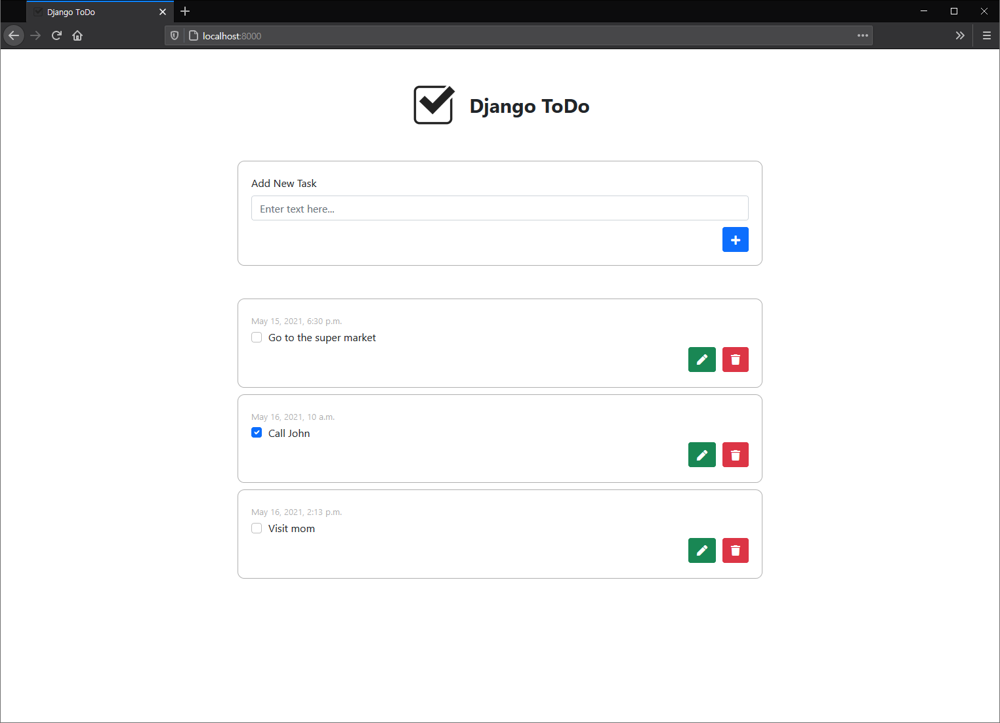

# Django ToDo

A simple ToDo application built with Django that provides Web GUI & REST API.



[REST API Document](doc/API.md)

## Usage

### Run with Docker

1. Build image

```shell
docker build -t django-todo .
```

2. Run container

```shell
docker run --detach --name django-todo --publish 8000:8000 django-todo
```

### Run directly

1. Install python packages

```shell
pip install -r requirements.txt
```

2. Initialize DB

```shell
python manage.py migrate
```

3. Collect static files

```shell
python manage.py collectstatic
```

4. Run ASGI

```shell
daphne -b 0.0.0.0 -p 8000 django_todo.asgi:application
```

### Other commands used in development

Create migrations for DB

```shell
python manage.py makemigrations todo
```

Create admin account

```shell
python manage.py createsuperuser
```

Run tests

```shell
python manage.py test todo
```

Run server

```shell
python manage.py runserver
```
